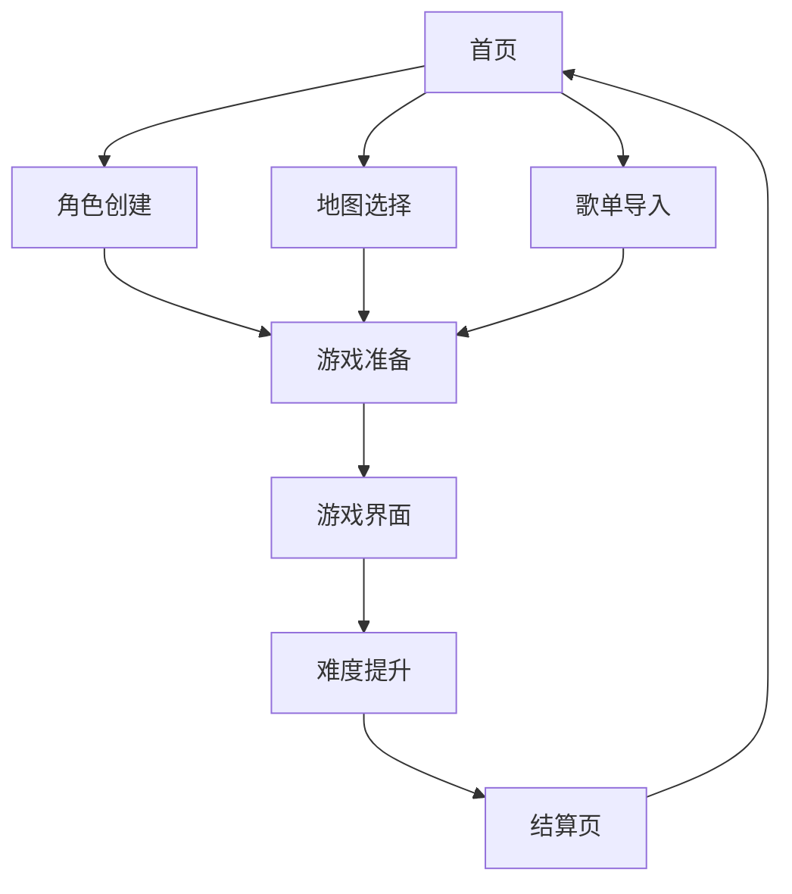

## 1. 产品概述
音乐打僵尸游戏是一款结合音乐节奏和动作射击的休闲游戏，玩家可以边听音乐边打僵尸。
- 主要目的是为玩家提供一个解压、娱乐的游戏体验，同时结合音乐元素增加游戏趣味性。
- 目标用户为喜欢音乐和动作游戏的休闲玩家，适合各个年龄段。

## 2. 核心功能

### 2.1 用户角色
| 角色 | 注册方式 | 核心权限 |
|------|---------------------|------------------|
| 普通玩家 | 无需注册 | 可直接进入游戏，创建角色，选择地图，导入歌单，进行游戏 |

### 2.2 功能模块
1. **首页**：游戏标题，开始游戏按钮，角色创建按钮，地图选择按钮，歌单导入按钮
2. **角色创建页**：角色形象自定义，包括发型、服装、肤色等选项
3. **地图选择页**：多种地图场景选择，如城市、森林、实验室等
4. **歌单导入页**：支持从外部音乐平台导入歌单，或选择内置解压音乐
5. **游戏页**：游戏主界面，包含角色、僵尸、武器、音乐播放器等
6. **结算页**：游戏结束后显示得分、奖励等信息

### 2.3 页面详情
| 页面名称 | 模块名称 | 功能描述 |
|-----------|-------------|---------------------|
| 首页 | 游戏标题 | 显示游戏名称，带有音乐节奏动画效果 |
| 首页 | 开始游戏 | 点击进入游戏准备界面 |
| 首页 | 角色创建 | 点击进入角色自定义界面 |
| 首页 | 地图选择 | 点击进入地图场景选择界面 |
| 首页 | 歌单导入 | 点击进入歌单管理界面 |
| 角色创建页 | 形象自定义 | 提供多种发型、服装、肤色等选项供玩家选择 |
| 地图选择页 | 地图预览 | 显示各个地图的缩略图和描述 |
| 歌单导入页 | 外部导入 | 支持从主流音乐平台导入歌单 |
| 歌单导入页 | 内置音乐 | 提供符合解压性质的内置音乐列表 |
| 游戏页 | 游戏界面 | 显示角色、僵尸、武器，实时响应音乐节奏 |
| 游戏页 | 武器系统 | 提供多种枪支和光剑选择 |
| 游戏页 | 难度系统 | 10级难度，僵尸速度和伤害随难度提升 |
| 结算页 | 得分显示 | 显示游戏得分和评价 |
| 结算页 | 奖励系统 | 显示获得的奖励，如移动速度提升等 |

## 3. 核心流程
玩家进入游戏后，首先创建角色形象，选择地图场景，然后导入歌单或选择内置音乐。进入游戏后，根据音乐节奏打僵尸，随着难度提升，僵尸速度和伤害会增加。每完成一个难度等级，获得相应奖励。游戏结束后，显示结算信息和奖励。

## 4. 用户界面设计
### 4.1 设计风格
- 主色调：深蓝色和荧光绿色（科技感）
- 辅助色：红色（用于强调和危险提示）
- 按钮风格：圆角矩形，带有轻微的3D效果和发光边缘
- 字体：无衬线字体，现代感强
- 布局风格：卡片式布局，简洁明了
- 图标风格：扁平化设计，带有轻微的渐变效果

### 4.2 页面设计概览
| 页面名称 | 模块名称 | UI元素 |
|-----------|-------------|-------------|
| 首页 | 游戏标题 | 大字体，带有音乐波形动画，背景为渐变色彩 |
| 首页 | 功能按钮 | 圆角矩形按钮，悬停时有发光效果，点击时有反馈动画 |
| 角色创建页 | 形象选择 | 滑动选择器，实时预览效果，带有轻微的动画过渡 |
| 地图选择页 | 地图卡片 | 带有地图缩略图，悬停时放大效果，点击时选中高亮 |
| 歌单导入页 | 音乐列表 | 卡片式列表，显示歌曲封面和名称，支持拖拽排序 |
| 游戏页 | 游戏场景 | 3D效果，带有动态光影，响应音乐节奏的视觉效果 |
| 游戏页 | 武器选择 | 侧边栏显示武器图标，点击切换，带有切换动画 |
| 结算页 | 奖励展示 | 弹出式动画，显示获得的奖励，带有光效和音效 |

### 4.3 响应性
- 桌面端优先设计，支持1920x1080及以上分辨率
- 移动端自适应，支持触摸操作，优化小屏幕显示
- 触摸优化：增大按钮点击区域，支持滑动操作

### 4.4 3D场景指导
- 环境：根据选择的地图场景，提供相应的3D环境，如城市废墟、森林、实验室等
- 光照：动态光照效果，随音乐节奏变化
- 相机：第三人称视角，跟随角色移动，支持轻微的镜头晃动
- 交互：角色移动和攻击动作流畅，僵尸动画自然
- 后处理效果：轻微的 bloom 效果，增强视觉冲击力
- 性能优化：使用低多边形模型，合理的纹理大小，确保流畅运行