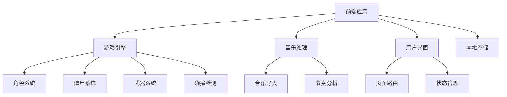
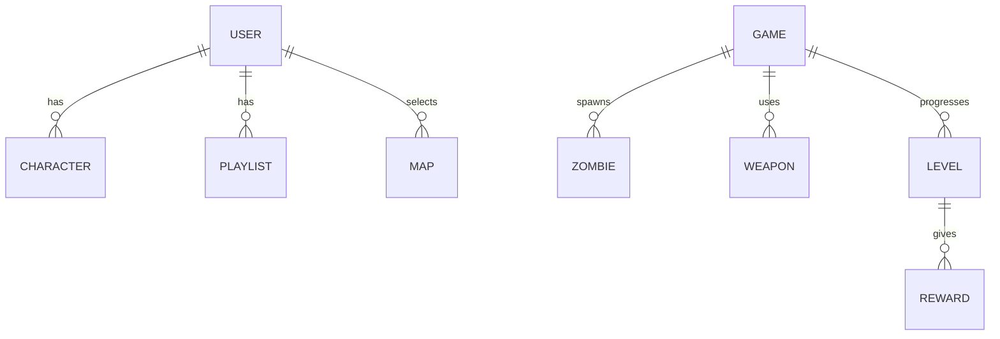

## 1. 架构设计

## 2. 技术描述
- 前端：React@18 + TypeScript + Tailwind CSS + Vite
- 游戏引擎：Three.js + @react-three/fiber + @react-three/drei
- 音乐处理：Web Audio API + Howler.js
- 状态管理：Zustand
- 本地存储：localStorage
- 构建工具：Vite

## 3. 路由定义
| 路由 | 用途 |
|-------|---------|
| / | 首页 |
| /character-create | 角色创建页 |
| /map-select | 地图选择页 |
| /playlist-import | 歌单导入页 |
| /game | 游戏页 |
| /result | 结算页 |

## 4. 数据模型
### 4.1 数据模型定义

### 4.2 数据定义
- **Character**：角色信息，包括发型、服装、肤色等自定义选项
- **Playlist**：歌单信息，包括歌曲列表、播放顺序等
- **Map**：地图信息，包括场景类型、背景、障碍物等
- **Game**：游戏状态，包括当前难度、得分、剩余生命值等
- **Zombie**：僵尸信息，包括类型、速度、伤害、生命值等
- **Weapon**：武器信息，包括类型、伤害、射速、 ammo 等
- **Level**：难度等级信息，包括僵尸数量、速度、伤害等
- **Reward**：奖励信息，包括类型、效果等

## 5. 核心功能实现
### 5.1 游戏引擎
- 使用 Three.js 创建 3D 游戏场景
- 实现角色移动和攻击动画
- 实现僵尸 AI 和动画
- 实现武器系统和射击效果
- 实现碰撞检测和物理效果

### 5.2 音乐处理
- 使用 Web Audio API 分析音乐节奏
- 实现音乐可视化效果
- 支持从外部音乐平台导入歌单
- 提供内置解压音乐列表

### 5.3 难度系统
- 实现 10 级难度
- 僵尸速度和伤害随难度提升
- 难度 5 后保持最大值
- 每级难度结束后提供奖励

### 5.4 武器系统
- 实现多种枪支类型
- 实现光剑系统（单手和双手）
- 武器切换和升级机制

### 5.5 奖励系统
- 移动速度提升
- 武器伤害提升
- 生命值增加
- 其他游戏内奖励

## 6. 性能优化
- 使用 React.memo 和 useMemo 优化组件渲染
- 实现对象池减少内存开销
- 合理使用 Three.js 的性能优化技术
- 音乐分析的性能优化

## 7. 技术挑战与解决方案
- **音乐节奏分析**：使用 Web Audio API 的 AnalyserNode 进行实时音频分析，提取节奏信息
- **3D 性能**：使用低多边形模型，合理的纹理大小，实现流畅的游戏体验
- **外部歌单导入**：使用浏览器的 File API 读取本地音乐文件，或通过第三方 API 导入歌单
- **响应式设计**：使用 Tailwind CSS 实现响应式布局，适配不同屏幕尺寸