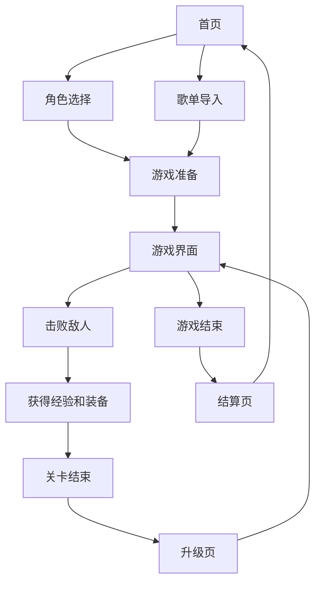

# 音乐 Roguelike 游戏设计文档

## 1. 产品概述
音乐 Roguelike 游戏是一款融合音乐节奏和 Roguelike 元素的动作游戏，玩家可以通过音乐节奏提升战斗力，类似《超时空要塞》中的音乐战斗系统，同时结合《土豆兄弟》和《元气骑士》的 Roguelike 玩法。
- 主要目的是为玩家提供一个结合音乐和动作的创新游戏体验，通过音乐节奏增强战斗乐趣。
- 目标用户为喜欢音乐游戏和 Roguelike 游戏的玩家，适合各个年龄段。

## 2. 核心功能

### 2.1 用户角色
| 角色 | 注册方式 | 核心权限 |
|------|---------------------|------------------|
| 普通玩家 | 无需注册 | 可直接进入游戏，选择角色，选择歌单，进行游戏 |

### 2.2 功能模块
1. **首页**：游戏标题，开始游戏按钮，角色选择按钮，歌单导入按钮，设置按钮
2. **角色选择页**：多种角色选择，每个角色有独特的技能和属性
3. **歌单导入页**：支持从外部音乐平台导入歌单，或选择内置音乐
4. **游戏页**：游戏主界面，包含角色、敌人、武器、音乐播放器等
5. **升级页**：每关结束后显示升级选项，提升角色属性和技能
6. **结算页**：游戏结束后显示得分、奖励等信息

### 2.3 页面详情
| 页面名称 | 模块名称 | 功能描述 |
|-----------|-------------|---------------------|
| 首页 | 游戏标题 | 显示游戏名称，带有音乐波形动画效果 |
| 首页 | 开始游戏 | 点击进入游戏准备界面 |
| 首页 | 角色选择 | 点击进入角色选择界面 |
| 首页 | 歌单导入 | 点击进入歌单管理界面 |
| 角色选择页 | 角色卡片 | 显示各个角色的属性、技能和形象 |
| 歌单导入页 | 外部导入 | 支持从主流音乐平台导入歌单 |
| 歌单导入页 | 内置音乐 | 提供符合游戏风格的内置音乐列表 |
| 游戏页 | 游戏场景 | 2D 或 3D 场景，随音乐节奏变化 |
| 游戏页 | 节奏指示器 | 显示音乐节拍，指导玩家攻击时机 |
| 游戏页 | 武器系统 | 提供多种武器选择，每种武器有不同的节奏特性 |
| 游戏页 | 技能系统 | 角色技能，需要按节奏释放 |
| 升级页 | 属性升级 | 提升角色的基础属性 |
| 升级页 | 技能升级 | 解锁或升级角色技能 |
| 结算页 | 得分显示 | 显示游戏得分和评价 |
| 结算页 | 奖励展示 | 显示获得的奖励和装备 |

## 3. 核心流程
玩家进入游戏后，首先选择角色，然后导入歌单或选择内置音乐。进入游戏后，根据音乐节奏进行战斗，击败敌人获得经验和装备。每完成一个关卡，获得升级机会。游戏结束后，显示结算信息和奖励。

## 4. 游戏机制

### 4.1 音乐节奏系统
- **节拍检测**：分析歌曲的节拍和节奏，生成节奏点
- **节奏攻击**：在节拍点进行攻击会获得伤害加成
- **节奏防御**：在节拍点进行防御会减少受到的伤害
- **节奏技能**：需要在特定节拍点释放的技能

### 4.2 Roguelike 元素
- **随机关卡**：每次游戏的关卡布局和敌人分布不同
- **永久死亡**：一旦角色死亡，游戏结束，需要重新开始
- **随机道具**：击败敌人后掉落随机道具和装备
- **角色升级**：通过获得经验值提升角色等级

### 4.3 角色系统
- **多个角色**：每个角色有独特的技能和属性
- **技能树**：角色有各自的技能树，可通过升级解锁
- **属性系统**：包括攻击力、防御力、移动速度、攻击速度等

### 4.4 武器系统
- **多种武器**：每种武器有不同的攻击方式和节奏特性
- **武器升级**：武器可以通过收集材料升级
- **武器特效**：武器有独特的特效和动画

### 4.5 敌人系统
- **多种敌人**：不同类型的敌人有不同的攻击模式和弱点
- **Boss 战**：每个关卡有独特的 Boss，需要特定策略击败
- **敌人 AI**：敌人会根据音乐节奏调整攻击模式

## 5. 用户界面设计
### 5.1 设计风格
- 主色调：霓虹紫色和蓝色（科技感）
- 辅助色：荧光绿色（用于强调和节奏指示）
- 按钮风格：圆角矩形，带有发光效果和动画
- 字体：无衬线字体，现代感强
- 布局风格：卡片式布局，简洁明了
- 图标风格：扁平化设计，带有轻微的渐变效果

### 5.2 页面设计概览
| 页面名称 | 模块名称 | UI元素 |
|-----------|-------------|-------------|
| 首页 | 游戏标题 | 大字体，带有音乐波形动画，背景为渐变色彩 |
| 首页 | 功能按钮 | 圆角矩形按钮，悬停时有发光效果，点击时有反馈动画 |
| 角色选择页 | 角色卡片 | 带有角色形象、属性和技能描述，悬停时放大效果 |
| 歌单导入页 | 音乐列表 | 卡片式列表，显示歌曲封面和名称，支持拖拽排序 |
| 游戏页 | 游戏场景 | 随音乐节奏变化的背景和光影效果 |
| 游戏页 | 节奏指示器 | 底部或顶部的节拍指示器，随音乐节拍变化 |
| 游戏页 | 角色状态 | 显示角色生命值、能量值、当前武器等信息 |
| 升级页 | 升级选项 | 卡片式升级选项，带有动画效果 |
| 结算页 | 奖励展示 | 弹出式动画，显示获得的奖励，带有光效和音效 |

### 5.3 响应性
- 桌面端优先设计，支持1920x1080及以上分辨率
- 移动端自适应，支持触摸操作，优化小屏幕显示
- 触摸优化：增大按钮点击区域，支持滑动操作

## 6. 技术实现
### 6.1 技术栈
- 前端：React + TypeScript + Vite
- 状态管理：Zustand
- 样式：Tailwind CSS
- 游戏渲染：Canvas 2D 或 Three.js
- 音乐处理：Web Audio API
- 部署：GitHub Pages

### 6.2 核心模块
1. **音乐分析模块**：分析歌曲的节拍和节奏
2. **游戏引擎模块**：处理游戏逻辑和物理碰撞
3. **渲染模块**：处理游戏画面和动画
4. **输入模块**：处理用户输入和节奏检测
5. **音效模块**：处理游戏音效和音乐播放

### 6.3 数据结构
- **角色数据**：包含角色属性、技能、装备等
- **武器数据**：包含武器属性、特效、升级路径等
- **敌人数据**：包含敌人属性、攻击模式、弱点等
- **关卡数据**：包含关卡布局、敌人分布、Boss 信息等

## 7. 游戏模式
1. **故事模式**：有固定的关卡和剧情
2. **无尽模式**：无限生成关卡，直到角色死亡
3. **挑战模式**：特定的挑战任务，如限时通关、只用特定武器等

## 8. 未来规划
1. **多人模式**：支持本地合作或在线 multiplayer
2. **自定义关卡**：玩家可以创建和分享自定义关卡
3. **Mod 支持**：支持玩家创建和安装 Mod
4. **成就系统**：添加游戏成就和排行榜

## 9. 结论
音乐 Roguelike 游戏将音乐节奏与 Roguelike 玩法相结合，创造出一种全新的游戏体验。通过音乐节奏提升战斗力的机制，让玩家在享受音乐的同时，体验到紧张刺激的战斗。结合《土豆兄弟》和《元气骑士》的 Roguelike 元素，增加了游戏的 replayability 和深度。